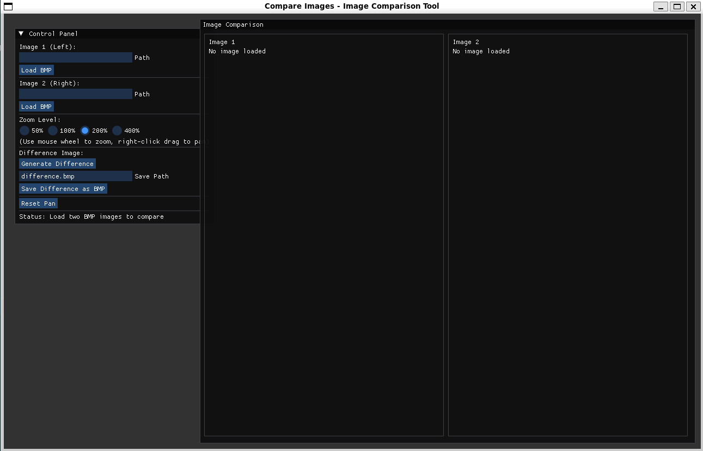

# Compare Images - Image Comparison Tool

A powerful image comparison application built with SFML and ImGui that allows you to compare two images side-by-side with synchronized viewing, arbitrary zoom levels, area selection, and multiple file format support.



## Features

### Basic Functionality
- **Load and Display Images**: Load two images (BMP, PNG, JPG, etc.) and view them side by side
- **Split View**: Images displayed with a vertical divider for easy comparison
- **Synchronized Zoom**: Zoom both images together with arbitrary zoom levels (10% - 1000%)
- **Synchronized Panning**: Pan both images simultaneously when zoomed in
- **Difference Image**: Generate an absolute RGB difference image
- **Export Results**: Save difference and selection images in multiple formats

### Extended Functionality
- **Arbitrary Zoom Levels**: Continuous zoom from 10% to 1000%, not just preset values
- **Different Image Sizes**: Automatically adjusts relative zoom when comparing images of different dimensions
- **Area Selection**: Select and extract a region from both images, combine them side-by-side
- **Multiple File Formats**: Support for BMP, PNG, JPG, and other formats supported by SFML

### Controls
- **Zoom**: 
  - Use the slider for precise zoom control (10% to 1000%)
  - Click quick zoom buttons (25%, 50%, 100%, 200%, 400%)
  - Use mouse wheel to zoom in/out
- **Pan**: Right-click (or middle-click) and drag to move both images together
- **Select Area**: Left-click and drag on Image 1 to select a region (shown on both images)
- **Reset**: Click "Reset Pan" button to return to default view position

## Building the Project

### Prerequisites

**Build Tools:**
- C++20 compatible compiler (gcc, clang, or MSVC)
- **uv** (required by build and setup scripts) - [Installation Guide](https://docs.astral.sh/uv/)
- Meson build system (≥ 1.3.0)
- Ninja build backend
- CMake (used by some subproject dependencies)
- pkg-config

**System Libraries (required by SFML):**
- X11 development libraries (Linux)
- OpenGL development libraries
- Audio libraries (ALSA/PulseAudio on Linux)
- Freetype development libraries

**Managed Dependencies (automatically downloaded by Meson):**
- SFML 3.0.1
- ImGui 1.91.6
- ImGui-SFML 3.0
- miniaudio 0.11.22

**Optional Tools:**
- **ImageMagick** (optional, for advanced image format conversions if needed)

#### Installing System Dependencies

On Ubuntu/Debian:
```bash
sudo apt install build-essential meson ninja-build cmake pkg-config \
  libx11-dev libxrandr-dev libxcursor-dev libxi-dev libudev-dev \
  libgl1-mesa-dev libopenal-dev libvorbis-dev libflac-dev \
  libfreetype-dev
```

On Arch Linux:
```bash
sudo pacman -S base-devel meson ninja cmake pkgconf \
  libx11 libxrandr libxcursor libxi systemd mesa openal \
  libvorbis flac freetype2
```

On macOS:
```bash
brew install meson ninja cmake pkg-config
```

### Build Instructions

1. Clone the repository:
```bash
git clone <repository-url>
cd compare-images-inator
```

2. Run the build script:
```bash
./build.sh
```

3. The executable will be created at:
```bash
build/compare-images-inator
```

## Usage

### Running the Application
```bash
./build/compare-images-inator
```

### Loading Images

1. **Load First Image**:
   - Enter the file path in the "Image 1 (Left)" text field
   - Click the "Load Image" button
   - Image dimensions will be displayed

2. **Load Second Image**:
   - Enter the file path in the "Image 2 (Right)" text field
   - Click the "Load Image" button
   - Image dimensions will be displayed

**Supported Formats**: BMP, PNG, JPG/JPEG, GIF, and other formats supported by SFML

### Comparing Images

1. Use the zoom controls to adjust magnification:
   - Use the slider for continuous zoom (10% to 1000%)
   - Click quick zoom buttons (25%, 50%, 100%, 200%, 400%)
   - Or use mouse wheel for quick zooming

2. Pan the images:
   - Right-click and drag to move both images synchronously
   - Useful when zoomed in and images exceed viewport size

3. Handle different-sized images:
   - Enable "Auto-match different image sizes" checkbox
   - Image 2 will be automatically scaled to match Image 1's apparent size
   - The relative zoom factor is displayed in the control panel

4. Reset view:
   - Click "Reset Pan" to return to original position

### Selecting and Extracting Areas

1. **Select an Area**:
   - Left-click and drag on Image 1 to draw a selection rectangle
   - The selection is shown in red on Image 1 and green on Image 2
   - The corresponding area is automatically mapped based on relative zoom

2. **Extract Selection**:
   - Click "Extract Selection" to combine both selected areas
   - A popup window shows the selections placed side-by-side
   - Use "Clear Selection" to remove the current selection

3. **Save Selection**:
   - Enter a filename in "Selection Save Path" (supports BMP, PNG, JPG)
   - Click "Save Selection" to export the combined image

### Generating Difference Images

1. Load both images first
2. Click "Generate Difference" button
3. A popup window will appear showing the difference image
4. The difference is calculated as the absolute value of RGB component differences

### Saving Images

1. **Save Difference Image**:
   - Generate a difference image first
   - Enter desired filename in "Diff Save Path" field
   - Click "Save Difference" button
   - Supports BMP, PNG, JPG based on file extension

2. **Save Selection Image**:
   - Extract a selection first
   - Enter desired filename in "Selection Save Path" field
   - Click "Save Selection" button

## Supported File Formats

The application now supports loading and saving images in multiple formats:

| Format | Load | Save |
|--------|------|------|
| BMP    | ✓    | ✓    |
| PNG    | ✓    | ✓    |
| JPG    | ✓    | ✓    |
| GIF    | ✓    | ✗    |
| TGA    | ✓    | ✓    |

## Project Structure

```
compare-images-inator/
├── src/
│   └── main.cpp           # Main application code
├── build/                 # Build output directory
├── subprojects/           # Dependencies (ImGui, SFML, etc.)
├── specification/         # Project specification document
├── meson.build           # Build configuration
├── build.sh              # Build script
└── README.md             # This file
```

## Technical Details

### Image Processing
- **Difference Calculation**: For each pixel, the absolute difference is computed for each RGB channel:
  ```
  R_diff = |R1 - R2|
  G_diff = |G1 - G2|
  B_diff = |B1 - B2|
  ```
- **Different Sizes**: When images have different dimensions, the smaller dimensions are used

### Performance
- Hardware-accelerated rendering using SFML
- Efficient texture management
- 60 FPS frame limit for smooth operation

## Troubleshooting

### "No such file or directory" Error
- Verify the file path is correct
- Use absolute paths or paths relative to the executable
- Ensure the file exists and has read permissions

### "Failed to load image" Error
- Ensure the file is in a supported format (BMP, PNG, JPG, GIF, TGA)
- Check that the file is not corrupted
- Verify the file has valid image data

### "Setting vertical sync not supported" Warning
- This is a benign warning on some systems
- The application will function normally despite this message

## License

See project specification for details.

## Authors

Project developed according to specification document 17: "Porównywanie obrazów" (Image Comparison).
